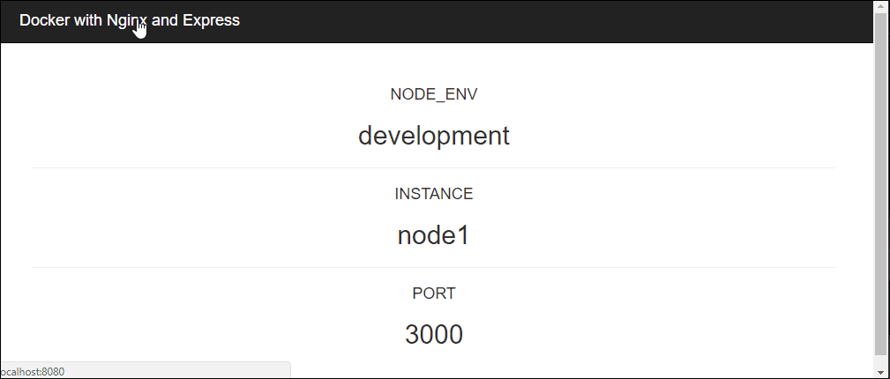

# docker-nginx-express

> A playground for Docker with Nginx and Express.



# Development

* Cloning the repo

```bash
$ git clone [Repo URL]
```

* Installing dependencies

```bash
$ npm install
```

# Docker

* Building an image

```bash
$ docker-compose build
```

* Running containers

```bash
$ docker-compose up -d
```

* Stopping  containers

```bash
$ docker-compose down
```

# Dynamically Adding Servers
* Add servers to nginx.conf
* Run this command
```
nginx -s reload
```
# Author

[Being Zero](https://fb.me/being0)

